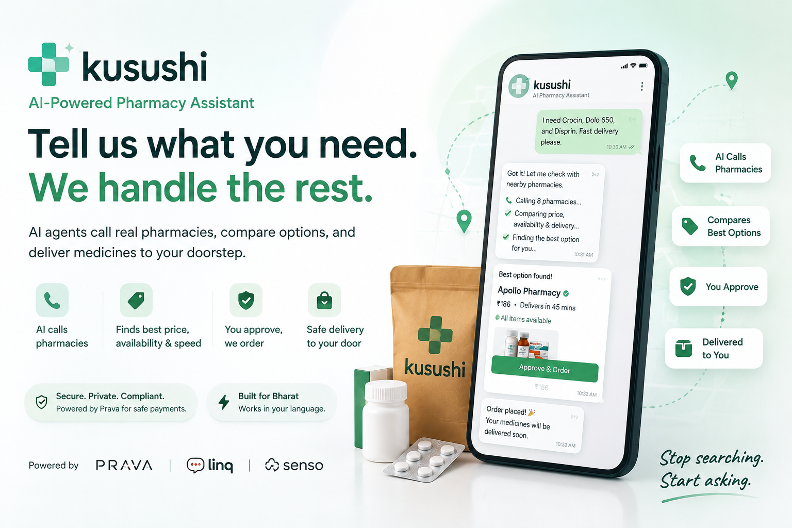

# 薬師 Kusushi



### The AI agent that gets your medicine.

Tell Kusushi what you need. It finds the right pharmacy, negotiates on your priorities, and completes the order — without you opening five apps or making a single phone call.

Built at the **Agentic Commerce Hackathon**, Aug 1–2, 2026.

---

## The problem

Buying medicine is fragmented. Today you search multiple pharmacy apps, call stores, compare strip sizes and prices, and repeat the entire ritual every month. Existing platforms only know their own inventory — none of them coordinate the real world.

This is especially painful for **caregivers**: adult children ordering for parents, family members managing medicine for elderly relatives. You shouldn't have to become a logistics expert to keep someone you love healthy.

## What Kusushi does

Kusushi is an AI agent for pharmacy and health purchases. One conversation, zero busywork.

1. **Tell it what you need** — type it, or upload a prescription. Kusushi understands the request — medicines, dosage, quantity. It also knows when you're *not* ordering (asking a question, saying hi) and replies in conversation instead of force-fitting everything into an order.
2. **It verifies your location** — geocodes your address against Google Maps and shows you a real map pin + canonical address as proof it looked at the map.
3. **It finds pharmacies** — discovers nearby pharmacies via Google Places (plus a built-in set of online pharmacies & quick-commerce platforms), contacts the top-rated ones, compares stock, price, and delivery time across them. Full-stock pharmacies always rank above partial-stock.
4. **It recommends — with reasons** — optimizes for *your* priority: cheapest, fastest, closest, or most reliable. Every choice is explainable, and the full agent activity (geocode → search → call → rank) streams live in a dashboard.
5. **It pays & confirms** — completes a real Prava-secured transaction. You approve with a passkey. No card ever leaves your hands.
6. **It remembers** — every conversation auto-saves to Supabase. Browse past chats in history, resume any of them, or delete the ones you don't need. Completed orders persist separately with full analytics.

The product does not promise the cheapest or fastest order. It optimizes around **your chosen priorities** — and explains why.

## Two-tier coverage: honest about the rails

Prava issues a virtual card scoped to one merchant, and for that card to succeed the merchant needs a real online checkout. Kusushi is built for both realities:

- **Tier 1 — Online pharmacies & quick-commerce (live now).** Apollo Pharmacy, Tata 1mg, Netmeds, Pharmeasy, Zepto, Blinkit, and Swiggy Instamart. Each has a real `https` checkout URL, so the full Prava lifecycle closes end-to-end: session created → passkey approved → virtual card issued → checkout completed (or declined in sandbox, then reported). This is the path the live demo runs.
- **Tier 2 — Local Kirana stores (roadmap).** Discovery already works — Kusushi finds nearby stores via Google Maps and calls them for stock. But a local store can't accept a Prava virtual card yet: it has no online portal. The fix is either onboarding these stores as Prava merchants, or building a UPI-rail bridge. Kusushi is architected to plug into either the day it ships.

## The name

Kusushi (薬師) is a traditional Japanese word for a healer — tied to 薬師如来 (Yakushi Nyorai, the Medicine Buddha), a figure of healing and compassion. We chose it because a great pharmacy agent should feel like a trusted healer, not a checkout form.

## How it works

```
User request (text or prescription)
        │
        ▼
┌─────────────────┐    OpenAI gpt-4o
│  Intake Agent   │ ◄── function calling (auto tool choice) + vision OCR
└────────┬────────┘    converses when not ordering, extracts when ordering
         │ structured medicine items
         ▼
┌─────────────────┐    Google Maps Geocoding
│   Geocode       │ ◄── address → canonical + map pin (shown to user)
└────────┬────────┘
         │ lat/lng
         ▼
┌─────────────────┐    Google Maps Places API + built-in online set
│   Discovery     │ ◄── real nearby pharmacies + online/quick-commerce (mock fallback)
└────────┬────────┘    each tagged tier: "online" (Prava-ready) vs "local" (roadmap)
         │ top-rated candidates
         ▼
┌─────────────────┐
│  Contact + Call │ ── simulated pharmacy calls with realistic transcripts
│   (streamed)    │ ── streamed live into the Agent Dashboard
└────────┬────────┘
         │ pharmacy quotes
         ▼
┌─────────────────┐
│ Recommendation  │ ── ranks by user priority (full stock > partial stock)
│     Engine      │ ── attaches human-readable explanation
└────────┬────────┘
         │ user approves
         ▼
┌─────────────────┐    Prava SDK/API (sandbox)
│  Prava Payment  │ ◄── session → passkey → virtual card → report-status
└────────┬────────┘
         │
         ▼
┌─────────────────┐    Supabase (Postgres + RLS)
│    Persist      │ ◄── order saved to `orders`, chat auto-saved to `chats`
└─────────────────┘
```

Kusushi uses a **collapsed-agent architecture**: instead of many micro-agents, the orchestration lives in a single intake step (OpenAI function calling with `tool_choice: "auto"` — the model decides whether to extract items or converse), with discovery and recommendation as deterministic logic. Reliability over architecture for a fast build.

## Tech stack

| Layer | Choice | Why |
|---|---|---|
| Frontend | Next.js 16, React 19, Tailwind v4 | Full-stack, single deploy, Vercel-native |
| UI | shadcn-style primitives, custom Kusushi design system | Fast, not a template |
| Agent + OCR | OpenAI gpt-4o (function calling + vision) | One provider for parsing and prescription reading |
| Maps | Google Maps Platform (Geocoding + Nearby Search) | Real pharmacy discovery + address verification |
| Payments | Prava SDK/API (sandbox) | Real transaction lifecycle, not a mock |
| Auth + DB | Supabase (Postgres + Auth + RLS) | Accounts, order history, persistence |
| iMessage | Linq API | Caregiver narrative lives in Messages |
| Trust & Context | Senso API | Validates pharmacy reputation and real-time operational context |

## The Prava integration

Every Kusushi order completes a real Prava transaction lifecycle:

1. **Create session** — Kusushi pins the merchant (the pharmacy's real checkout URL), amount, and line items.
2. **User approves** — passkey authentication grants spending permission.
3. **Virtual card issued** — Prava hands the agent a one-time, merchant-scoped Visa credential (network token + dynamic CVV).
4. **Agent checks out** — the agent uses those credentials at the merchant.
5. **Report status** — the agent reports `APPROVED`/`DECLINED` back to Prava, closing the loop.

**The loop always closes.** Per Prava's docs, `report-status` is mandatory after a checkout attempt. If the passkey step is abandoned or times out before a card is issued, Kusushi calls the **revoke** endpoint (`POST /v1/sessions/:id/revoke`) instead — so no real Prava session is ever left dangling as `pending`.

In the sandbox, the test card declines at the real merchant — and that's the expected, accepted outcome per the Prava team: *"reaching this flow validates the next step, which is switching to production keys for a real transaction."*

To protect the shared test card's 30-transaction/day limit, the app has a **Demo/Live toggle** (default Demo). Demo mode runs the full Prava lifecycle against a mock — no real session, no transaction count burned. Live mode does the real sandbox flow. Guest users (instant login) are locked to Demo mode; only magic-link-authenticated users can flip Live.

## The Supabase layer

- **Auth** — email magic-link sign-in. `/login` sends a link, `/auth/callback` exchanges it for a session (handles both PKCE and implicit token flows). A dev-only instant login (`/api/dev-login`) mints a session via the admin API to bypass the built-in email sender's rate limit during local testing (gated to non-production).
- **Orders table** — every completed order persists with items, geocoded location, priority, chosen pharmacy, total, ETA, payment mode, status, and the full recommendation + call transcripts as JSONB. Immutable — no delete policy.
- **Chats table** — every conversation auto-saves (debounced) with the full message stream, items, address, geo, priority, and stage. Users can browse, resume, and delete their chats. See `supabase/schema.sql`.
- **Profile** — default delivery address stored in `auth.users.user_metadata` (no extra table), editable via the profile dropdown with a verify-on-map step.
- **Row Level Security** — every table is owner-scoped. A user can only read/insert/update their own rows. Chats allow delete; orders don't.
- **Order history** — `/orders` shows aggregate stats (orders, total spent, avg ETA, live txns) plus a reverse-chronological list with per-order item chips.
- **Chat history** — `/chats` shows saved conversations with title, address, item count, and timestamp. Click to resume, trash icon to delete.

## Run it locally

```bash
git clone https://github.com/devpras22/kusushi.git
cd kusushi
npm install
cp .env.local.example .env.local   # fill in keys (all optional — runs in mock mode without them)
npm run dev
```

Open [http://localhost:3000](http://localhost:3000).

**Without any API keys, the app runs in full mock mode** — a deterministic agent parser, a static pharmacy dataset, and a simulated Prava lifecycle. Every key you add lights up a real path:

| Key | Unlocks |
|---|---|
| `OPENAI_API_KEY` | Real agent parsing (any phrase) + prescription OCR |
| `PRAVA_SECRET_KEY` | Real sandbox payment lifecycle |
| `LINQ_API_KEY` | iMessage agent flow |
| `SENSO_API_KEY` | Dynamic pharmacy reputation and trust scoring |
| `GOOGLE_MAPS_API_KEY` | Real pharmacy discovery + address geocoding |
| `NEXT_PUBLIC_SUPABASE_URL` + `NEXT_PUBLIC_SUPABASE_ANON_KEY` | Auth + order persistence |
| `SUPABASE_SERVICE_ROLE_KEY` | Server-only admin ops (dev login, bypasses RLS) |

### Database setup

The `orders` and `chats` tables must exist before auth/persistence works. Run `supabase/schema.sql` once in the Supabase SQL Editor (or via the pooler connection). It creates both tables, indexes, and RLS policies.

Then in **Supabase → Authentication → URL Configuration**, set:
- **Site URL**: your dev/production origin (e.g. `http://localhost:3000`)
- **Redirect URLs**: add `{origin}/auth/callback`

## Project structure

```
src/
├── app/
│   ├── page.tsx                 # Landing page
│   ├── login/                   # Magic-link sign-in + dev instant login
│   ├── orders/                  # Order history + analytics
│   ├── chats/                   # Chat history (browse, resume, delete)
│   ├── auth/callback/           # Session exchange (PKCE + implicit flows)
│   ├── app/                     # The chat application
│   └── api/
│       ├── extract/             # OpenAI function-calling extraction (auto tool choice)
│       ├── ocr/                 # OpenAI vision prescription reading
│       ├── geocode/             # Google Maps address verification + map embed
│       ├── discover/            # Geocode + Places + simulated calls + ranking
│       ├── pay/ (+ poll, report, revoke) # Prava session lifecycle (revoke closes abandoned sessions)
│       ├── orders/save/         # Persist completed order (RLS-protected)
│       ├── chats/save + [id]/   # Upsert + delete chat history (RLS-protected)
│       ├── profile/address/     # Update default address in user_metadata
│       ├── dev-login/           # Dev-only admin API session mint
│       ├── auth/set-session/    # Implicit-flow token → session cookie
│       └── linq/ (send, webhook)# iMessage agent flow
├── components/
│   ├── agent-dashboard.tsx      # Live activity feed + expandable call cards
│   ├── location-verified.tsx    # "Proof we looked at the map" card
│   ├── user-menu.tsx            # Profile dropdown (email, address, sign-out w/ confirm)
│   ├── address-editor.tsx       # Editable address with verify-on-map dialog
│   ├── new-chat-button.tsx      # Header "start fresh" button
│   ├── chats/delete-button.tsx  # Delete a saved chat
│   ├── brand.tsx
│   └── ui/                      # Button, Card, Badge, DropdownMenu primitives
└── lib/
    ├── agent.ts                 # OpenAI extraction (auto tool choice, mock fallback)
    ├── maps.ts                  # Google Maps Geocoding + Nearby Search
    ├── call-simulator.ts        # Realistic pharmacy call transcripts
    ├── prava.ts                 # Prava client (mock fallback)
    ├── linq.ts                  # Linq iMessage client
    ├── supabase/                # browser + server + service-role clients
    └── types.ts                 # Domain types
supabase/
└── schema.sql                   # orders + chats tables + RLS policies
```

## Tracks

- **Prava** — the transaction is the core action, not a bolt-on.
- **OpenAI** — gpt-4o powers both the conversational agent and prescription OCR.
- **Visa Intelligent Commerce** — passkey approval, spending controls, trust by design.
- **Linq** — the caregiver conversation that already happens over iMessage.
- **Senso** — injecting verified, real-world context into pharmacy reputation scoring.
- **Google Maps** — real pharmacy discovery and address verification.

## Built at

**Agentic Commerce Hackathon** · Aug 1–2, 2026 · Virtual
